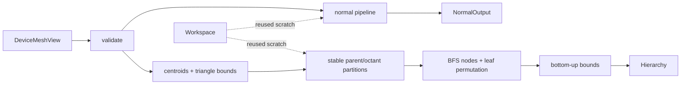

# meshprep-cuda

Deterministic CUDA C++ mesh preprocessing: face/vertex normals and eight-way AABB hierarchy construction.

`meshprep-cuda` is a small C++20 library for pipelines that already keep indexed triangle meshes on the GPU. It turns caller-owned device buffers into reusable, device-resident normal and hierarchy outputs. Stable CUB sorting replaces atomic scatter order, so topology, primitive permutation, and corner-normal indices are repeatable on the same supported environment.

## Why this project exists

The implementation began as working production geometry code with two concrete defects: identical builds emitted different topology, and a two-dimensional launch failed on the 9,963,191-triangle San Miguel scene. The current design makes ordering part of the API contract and uses flattened launches throughout. The refactor is intentionally preserved in Git history.

## Highlights

- normalized face normals and area-weighted vertex normals;
- caller-provided sharp-edge splitting, including duplicate and non-manifold inputs;
- stable `(vertex, triangle, corner)` adjacency and `(parent, octant)` partitioning with CUB;
- breadth-first eight-way hierarchy with contiguous child and primitive ranges;
- reusable movable RAII workspace and outputs, with no exceptions across the API;
- validation for non-finite coordinates, indices, sharp-edge endpoints, and 32-bit limits;
- seeded CPU-reference tests, 100-run determinism checks, Compute Sanitizer gates, and a 10M-triangle scale test;
- CMake install/export for `find_package(meshprep-cuda CONFIG REQUIRED)`.

## Requirements

- Linux;
- CMake 3.25 or newer;
- a C++20 compiler;
- CUDA Toolkit 12.6 or newer and a supported NVIDIA GPU.

CUDA 13.1 on compute capability 8.6 is the runtime-validated configuration for v0.1.0. CI compile-checks CUDA 12.6 and 13.1.

## Build and test

```bash
cmake -S . -B build \
  -DCMAKE_BUILD_TYPE=Release \
  -DCMAKE_CUDA_ARCHITECTURES=86
cmake --build build -j
ctest --test-dir build --output-on-failure
./scripts/run_sanitizers.sh build/meshprep-tests
```

The test and sanitizer commands need a CUDA-capable host. Tests cover smooth and sharp meshes, a sharp cube, disconnected fans, duplicate edges, a non-manifold edge, degenerate faces, identical centroids, invalid inputs, and seeded triangle soup.

## API

```cpp
meshprep::Workspace workspace;
meshprep::NormalOutput normals;
meshprep::Hierarchy hierarchy;

meshprep::Status normal_status = meshprep::compute_normals(
    mesh, sharp_edges, workspace, normals, stream);
meshprep::Status hierarchy_status = meshprep::build_hierarchy(
    mesh, {.max_leaf_size = 8}, workspace, hierarchy, stream);
```

See [`examples/basic.cu`](examples/basic.cu) for a complete upload/use example and [`docs/API.md`](docs/API.md) for ownership and synchronization contracts.



Calls are synchronous before return in v0.1.0. Inputs and outputs stay on the device. Output objects own their allocations; views do not. One `Workspace` must not be used concurrently by multiple calls.

## Performance snapshot

On an RTX 3050 Ti Laptop GPU (4 GB, compute capability 8.6), CUDA 13.1, five warmups and 30 samples:

| Scene | Triangles | Median | p5–p95 | Median throughput | Workspace | Output |
| --- | ---: | ---: | ---: | ---: | ---: | ---: |
| Sibenik | 73,564 | 2.349 ms | 2.290–2.479 ms | 31.3 Mtri/s | 15.5 MiB | 5.9 MiB |
| Sponza | 262,267 | 6.708 ms | 5.789–6.810 ms | 39.1 Mtri/s | 55.1 MiB | 21.0 MiB |
| San Miguel | 9,963,191 | 239.265 ms | 238.910–240.019 ms | 41.6 Mtri/s | 2.04 GiB | 798 MiB |

The deterministic implementation is slower than the legacy code and the pinned `cuda-lbvh` reference on the small published scenes. These algorithms also emit different hierarchy contracts, so the figures are not interchangeable. See [`docs/PERFORMANCE.md`](docs/PERFORMANCE.md) for methodology, comparisons, and limitations.

## Scope

v0.1.0 does not provide a C ABI, Python binding, CPU fallback, Windows support, traversal API, dynamic mesh updates, or bundled third-party scenes. Vertices and triangles must each number fewer than `2^32`. Determinism is guaranteed for repeated calls with identical inputs, options, CUDA software, and GPU architecture; floating-point values are compared to documented tolerances across environments.

## License

Project source is available under the [MIT License](LICENSE). Benchmark scenes and reference implementations are not redistributed and retain their own licenses; see [`THIRD_PARTY_NOTICES.md`](THIRD_PARTY_NOTICES.md).
