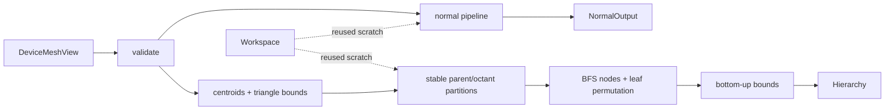

# ParallelMater

Deterministic CUDA C++ mesh preprocessing: face/vertex normals and eight-way AABB hierarchy construction.

ParallelMater is an MIT-licensed C++20/CUDA library for applications that keep geometry
and simulation state on the GPU. Its stable core builds normals and spatial
hierarchies. Its general-purpose physics layer loads fixed-topology volumetric
soft bodies, advances deterministic spring constraints and fracture, and lets
applications insert their own CUDA contact kernels through explicit coupling
buffers. No renderer, window system, input model, or game rules are required.

Stable CUB sorting replaces atomic scatter order, so topology, primitive
permutation, and corner-normal indices are repeatable on the same supported
environment.

The repository also includes an optional
[native CUDA/OpenGL simulation gallery](apps/water_lab/README.md). Its nine
numbered scenes are integration examples, not the primary library API.

Rectangle-edge contact is covered by a deterministic 1,980-frame headless
experiment. The retained smooth contact shell reduced measured corner vibration
by 83.6% without increasing penetration or skin-physics time; methodology,
failed candidates, limitations, and reproduction commands are in
[`docs/CONTACT_STABILITY.md`](docs/CONTACT_STABILITY.md).

Soft-body fracture is also capture-driven. The saved 245-frame failure now
replays from authored rest and gates supported triangle area, edge length,
retained surface, orientation, and finiteness. The current solver reduces
broken bonds from 4,230 to 483 and keeps structurally supported triangles within
0.6039–1.3759× rest area, with a 1.2780× maximum edge and no supported
inversions, while retaining at least 94.75% of the surface. Fractured bonds no
longer hide their adjacent material triangles; the headless audit still
measures supported and detached geometry separately. The combined `V` view
shows internal voxels and colors broken lattice connections red. See
[`docs/SOFT_BODY_STABILITY.md`](docs/SOFT_BODY_STABILITY.md).

## Why this project exists

The implementation began as working production geometry code with two concrete defects: identical builds emitted different topology, and a two-dimensional launch failed on the 9,963,191-triangle San Miguel scene. The current design makes ordering part of the API contract and uses flattened launches throughout. The refactor is intentionally preserved in Git history.

## Highlights

- normalized face normals and area-weighted vertex normals;
- caller-provided sharp-edge splitting, including duplicate and non-manifold inputs;
- stable `(vertex, triangle, corner)` adjacency and `(parent, octant)` partitioning with CUB;
- breadth-first eight-way hierarchy with contiguous child and primitive ranges;
- generic device-AABB hierarchy input for particles and non-triangle primitives;
- reusable movable RAII workspace and outputs, with no exceptions across the API;
- separately linkable `ParallelMater::physics` soft-body solver with application-owned contacts;
- versioned `.msb` lattice assets, fixed stepping, fracture statistics, live
  material controls, and borrowed CUDA node/bond/surface views;
- validation for non-finite coordinates, indices, sharp-edge endpoints, and 32-bit limits;
- seeded CPU-reference tests, 100-run determinism checks, Compute Sanitizer gates, and a 10M-triangle scale test;
- CMake install/export for `find_package(ParallelMater CONFIG REQUIRED)`.

## General-purpose physics API

`<parallel_mater/physics.hpp>` and the `ParallelMater::physics` CMake target are independent
of the gallery. A `SoftBody` owns CUDA state and a converted `.msb` lattice.
Use `step()` for a complete fixed update, or use the frame/substep protocol to
run custom CUDA contact kernels between prediction and constraint completion:

```cpp
parallel_mater::physics::SoftBodyOptions options;
options.instance_origins[0] = {0.0F, 1.0F, 0.0F};

parallel_mater::physics::SoftBody body;
parallel_mater::Status status = body.initialize("asset.msb", options);
if (status) status = body.begin_frame();

const float dt = options.timestep / options.substeps;
for (std::uint32_t i = 0; status && i < options.substeps; ++i) {
    status = body.prepare_substep(dt, gravity, stream);
    if (!status) break;
    auto nodes = body.nodes(); // write impulses/corrections with your kernels
    status = body.finish_substep(dt, gravity, stream);
}

parallel_mater::physics::SoftBodyTimings timings;
if (status) status = body.finish_frame(timings, stream);
```

See [`examples/soft_body.cu`](examples/soft_body.cu) for a custom analytic
ground contact. Public calls return `Status`; owning objects are movable;
device views are borrowed and must be reacquired after stepping. A narrow
package-level timing baseline is recorded in
[`docs/PHYSICS_PERFORMANCE.md`](docs/PHYSICS_PERFORMANCE.md).

## Optional gallery API

When configured with `-DPARALLEL_MATER_BUILD_GALLERY=ON`, the dependency-free
`<parallel_mater/game.hpp>` header defines the native recipe
catalog, fluent `SimulationConfig`, goals, progress evaluation, and automatic
`Campaign` progression. `<parallel_mater/gallery.hpp>` adds borrowed CUDA render
views and `SimulationBuilder`, which turns a portable configuration into an
owning headless CUDA simulation. The separately exported
`ParallelMater::gallery` target owns and steps those recipes headlessly;
it has no GLFW, OpenGL, ray-tracer, or HUD dependency. Native and headless
recipes share one preset factory; optional gravity and solver-iteration
overrides are explicit, and `resolved_physics()` reports what was selected.
The optional gallery has a 20,000-particle hemispherical paint bowl with a dynamic sphere,
closed-box rigid-sphere/cloth and rigid-sphere/soft-body examples, a combined
sphere/particle/catching-cloth scene, a torque-driven water wheel with compliant
axle-to-rim soft crosses, a load-bearing procedural soft sphere rolling over
ground cloth into hanging cloth, and a rigid sphere tethered to a central post
by a procedural rope, and a forty-tile rope bridge carrying a soft sphere. The native `P`
panel exposes active particle count and physical water-skin detail where
applicable. These scene recipes remain experimental and are deliberately
separate from the general physics contract.

```bash
./build/parallel-mater-gallery-example
./build/parallel-mater-lab --context 6
```

See [`examples/simulation_contexts.cu`](examples/simulation_contexts.cu) for
consumer code and
[`docs/SIMULATION_API_ARCHITECTURE.md`](docs/SIMULATION_API_ARCHITECTURE.md)
for the extraction boundary and current experimental limitations. The complete
native-app dependency map and reading order are in
[`docs/GALLERY_APP_STUDY.md`](docs/GALLERY_APP_STUDY.md).

## Requirements

- Linux;
- CMake 3.25 or newer;
- a C++20 compiler;
- CUDA Toolkit 12.6 or newer and a supported NVIDIA GPU.

CUDA 13.1 on compute capability 8.6 is the runtime-validated configuration for v0.1.0. CI compile-checks CUDA 12.6 and 13.1.

## Build and test

```bash
cmake -S . -B build \
  -DCMAKE_BUILD_TYPE=Release \
  -DCMAKE_CUDA_ARCHITECTURES=86 \
  -DPARALLEL_MATER_BUILD_TESTS=ON \
  -DPARALLEL_MATER_BUILD_EXAMPLES=ON
cmake --build build -j
ctest --test-dir build --output-on-failure
./scripts/run_sanitizers.sh build/meshprep-tests
```

The default package build is intentionally small: geometry and general physics
only. Benchmarks, tests, capture tools, the nine-scene gallery API, and the
OpenGL app are opt-in CMake options. CI enables all of them explicitly.

The test and sanitizer commands need a CUDA-capable host. Tests cover smooth and sharp meshes, a sharp cube, disconnected fans, duplicate edges, a non-manifold edge, degenerate faces, identical centroids, invalid inputs, and seeded triangle soup.

## API

```cpp
parallel_mater::Workspace workspace;
parallel_mater::NormalOutput normals;
parallel_mater::Hierarchy hierarchy;

parallel_mater::Status normal_status = parallel_mater::compute_normals(
    mesh, sharp_edges, workspace, normals, stream);
parallel_mater::Status hierarchy_status = parallel_mater::build_hierarchy(
    mesh, {.max_leaf_size = 8}, workspace, hierarchy, stream);

parallel_mater::Status particle_hierarchy_status = parallel_mater::build_hierarchy(
    parallel_mater::DeviceAabbView{device_bounds, particle_count},
    {.max_leaf_size = 8}, workspace, hierarchy, stream);
```

For an optional complete gallery preset, the convenience API is intentionally small:

```cpp
parallel_mater::sim::GallerySimulation simulation;
parallel_mater::Status status =
    parallel_mater::sim::SimulationBuilder(
        parallel_mater::sim::ExampleContext::particle_bowl)
        .particles(20'000)
        .iterations(4)
        .build(simulation);

if (status) status = simulation.step();
auto frame = simulation.render_view(); // borrowed CUDA device views
```

See [`examples/basic.cu`](examples/basic.cu) for geometry,
[`examples/soft_body.cu`](examples/soft_body.cu) for physics, and
[`docs/API.md`](docs/API.md) for ownership and synchronization contracts.



Calls are synchronous before return in v0.1.0. Inputs and outputs stay on the device. Output objects own their allocations; views do not. One `Workspace` must not be used concurrently by multiple calls.

The former `<meshprep/...>` headers, `meshprep` namespace, and build-tree target
aliases remain temporarily available for source compatibility. New consumers
should use the `parallel_mater` headers/namespace and `ParallelMater::` CMake
targets. This compatibility layer does not create a second implementation.

## Performance snapshot

On an RTX 3050 Ti Laptop GPU (4 GB, compute capability 8.6), CUDA 13.1, five warmups and 30 samples:

| Scene | Triangles | Median | p5–p95 | Median throughput | Workspace | Output |
| --- | ---: | ---: | ---: | ---: | ---: | ---: |
| Sibenik | 73,564 | 2.349 ms | 2.290–2.479 ms | 31.3 Mtri/s | 15.5 MiB | 5.9 MiB |
| Sponza | 262,267 | 6.708 ms | 5.789–6.810 ms | 39.1 Mtri/s | 55.1 MiB | 21.0 MiB |
| San Miguel | 9,963,191 | 239.265 ms | 238.910–240.019 ms | 41.6 Mtri/s | 2.04 GiB | 798 MiB |

The deterministic implementation is slower than the legacy code and the pinned `cuda-lbvh` reference on the small published scenes. These algorithms also emit different hierarchy contracts, so the figures are not interchangeable. See [`docs/PERFORMANCE.md`](docs/PERFORMANCE.md) for methodology, comparisons, and limitations.

## Scope

v0.1.0 does not provide a C ABI, Python binding, CPU fallback, Windows support, public traversal API, dynamic mesh updates, or bundled third-party scenes. Vertices, triangles, and AABB primitives must remain within documented 32-bit limits. Determinism is guaranteed for repeated calls with identical inputs, options, CUDA software, and GPU architecture; floating-point values are compared to documented tolerances across environments.

## License

Project source is available under the [MIT License](LICENSE). Benchmark scenes and reference implementations are not redistributed and retain their own licenses; see [`THIRD_PARTY_NOTICES.md`](THIRD_PARTY_NOTICES.md).
